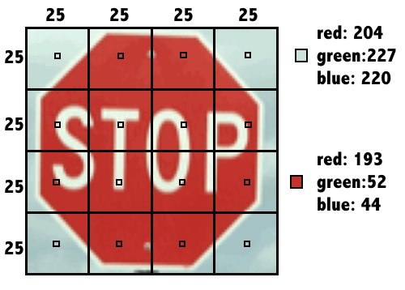
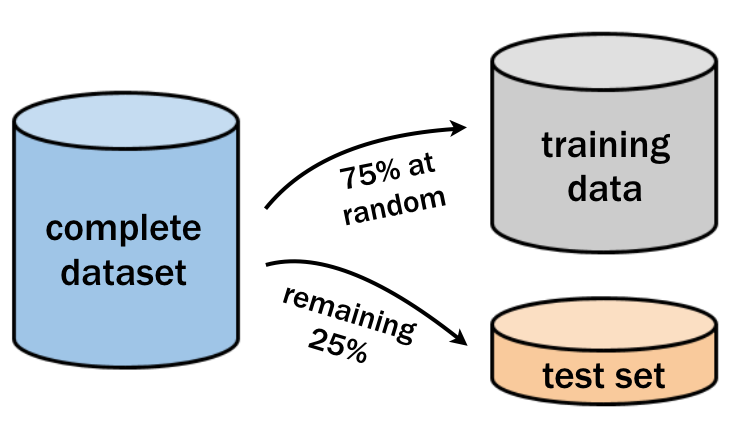

```{r, echo = F, warnings = F, message = F}
suppressPackageStartupMessages({
  library(tidyverse)
})
```


# Supervised Learning: Classification

##  k-Nearest Neighbors (kNN)

[Slides](Slides/Course1/chapter1.pdf)

### Recognizing a road sign with kNN

After several trips with a human behind the wheel, it is time for the self-driving car to attempt the test course alone.

As it begins to drive away, its camera captures the following image:


Can you apply a kNN classifier to help the car recognize this sign?

**Instructions**

```{r, echo = FALSE}

all_signs <- read.csv("Data/1Classification/knn_traffic_signs.csv")
  
signs <- all_signs %>% 
  filter(sample == "train") %>% 
  select(-c(1,2))

next_sign <- all_signs[206, ] %>% 
  select(-c(1,2, 3))
```


The dataset `signs` is loaded in your workspace along with the dataframe `next_sign`, which holds the observation you want to classify.

- Load the `class` package.
- Create a vector of sign labels to use with kNN by extracting the column `sign_type` from `signs`.
- Identify the `next_sign` using the `knn()` function.
- Set the `train` argument equal to the `signs` data frame without the first column.
- Set the `test` argument equal to the data frame `next_sign`.
- Use the vector of labels you created as the `cl` argument.

```{r}
# Load the 'class' package
library(class)

# Create a vector of labels
sign_types <- signs$sign_type

# Classify the next sign observed
knn(train = signs[,-1], test = next_sign, cl = sign_types)
```

### Exploring the traffic sign dataset

To better understand how the `knn()` function was able to classify the stop sign, it may help to examine the training dataset it used.

Each previously observed street sign was divided into a 4x4 grid, and the red, green, and blue level for each of the 16 center pixels is recorded as illustrated here.



The result is a dataset that records the `sign_type` as well as 16 x 3 = 48 color properties of each sign.

**Instructions**

- Use the `str()` function to examine the `signs` dataset.
- Use `table()` to count the number of observations of each sign type by passing it the column containing the labels.
- Run the provided `aggregate()` command to see whether the average red level might vary by sign type.

```{r}
# Examine the structure of the signs dataset
# str(signs)

# Count the number of signs of each type
table(signs$sign_type)

# Check r10's average red level by sign type
aggregate(r10 ~ sign_type, data = signs, mean)
```

### Classifying a collection of road signs

Now that the autonomous vehicle has successfully stopped on its own, your team feels confident allowing the car to continue the test course.

The test course includes 59 additional road signs divided into three types:


At the conclusion of the trial, you are asked to measure the car's overall performance at recognizing these signs.

**Intructions**

```{r, echo = FALSE}
test_signs <- all_signs %>% 
  filter(!sample == "train") %>% 
  select(-c(1,2))
```


The class package and the dataset signs are already loaded in your workspace. So is the dataframe test_signs, which holds a set of observations you'll test your model on.

- Classify the `test_signs` data using `knn()`.
- Set `train` equal to the observations in `signs` without labels.
- Use `test_signs` for the `test` argument, again without labels.
- For the `cl` argument, use the vector of labels provided for you.
- Use `table()` to explore the classifier's performance at identifying the three sign types.
- Create the vector `signs_actual` by extracting the labels from `test_signs`.
- Pass the vector of predictions and the vector of actual signs to `table()` to cross tabulate them.
- Compute the overall accuracy of the kNN learner using the `mean()` function

```{r}
# Use kNN to identify the test road signs
sign_types <- signs$sign_type
signs_pred <- knn(train = signs[-1], test = test_signs[-1], cl = sign_types)

# Create a confusion matrix of the actual versus predicted values
signs_actual <- test_signs$sign_type
table(signs_pred, signs_actual)

# Compute the accuracy
mean(signs_pred == signs_actual)
```

### Testing other 'k' values

By default, the `knn()` function in the class package uses only the single nearest neighbor.

Setting a `k` parameter allows the algorithm to consider additional nearby neighbors. This enlarges the collection of neighbors which will vote on the predicted class.

Compare `k` values of 1, 7, and 15 to examine the impact on traffic sign classification accuracy.

**Instructions**

```{r, echo = FALSE}
signs_test <- all_signs %>% 
  filter(!sample == "train") %>% 
  select(-c(1,2))
```

The class package is already loaded in your workspace along with the datasets signs and signs_test. The object signs_actual holds the true values of the signs.

- Compute the accuracy of the default `k = 1` model using the given code.
- Modify the `knn()` function call by setting `k = 7`.
- Revise the code once more by setting `k = 15` and compare the three accuracy values.

```{r}
# Compute the accuracy of the baseline model (default k = 1)
k_1 <- knn(train = signs[-1], test = signs_test[-1], cl = signs$sign_type, k = 1)
mean(k_1 == signs_test$sign_type)

# Modify the above to set k = 7
k_7 <- knn(train = signs[-1], test = signs_test[-1], cl = signs$sign_type, k = 7)
mean(k_7 == signs_test$sign_type)

# Set k = 15 and compare to the above
k_15 <- knn(train = signs[-1], test = signs_test[-1], cl = signs$sign_type, k = 15)
mean(k_15 == signs_test$sign_type)
```

### Seeing how the neighbors voted

When multiple nearest neighbors hold a vote, it can sometimes be useful to examine whether the voters were unanimous or widely separated.

For example, knowing more about the voters' confidence in the classification could allow an autonomous vehicle to use caution in the case there is any chance at all that a stop sign is ahead.

In this exercise, you will learn how to obtain the voting results from the `knn()` function.

**Instructions**

The class package has already been loaded in your workspace along with the dataset signs.

- Build a kNN model with the `prob = TRUE` parameter to compute the vote proportions. Set `k = 7`.
- Use the `attr()` function to obtain the vote proportions for the predicted class. These are stored in the attribute `"prob"`.
- Examine the first several vote outcomes and percentages using the `head()` function to see how the confidence varies from sign to sign.

```{r}
# Use the prob parameter to get the proportion of votes for the winning class
sign_pred <- knn(train = signs[-1], test = signs_test[-1], cl = signs$sign_type, prob = T, k = 7)

# Get the "prob" attribute from the predicted classes
sign_prob <- attr(sign_pred, "prob")

# Examine the first several predictions
head(sign_pred)

# Examine the proportion of votes for the winning class
head(sign_prob)
```

## Naive Bayes

[Slides](Slides/Course1/chapter2.pdf)

### Computing probabilities

The `where9am` data frame contains 91 days (thirteen weeks) worth of data in which Brett recorded his `location` at 9am each day as well as whether the daytype was a `weekend` or `weekday`.

Using the conditional probability formula below, you can compute the probability that Brett is working in the office, given that it is a weekday.

$$P(A\mid B)=\frac{P(A\land B)}{P(B)}$$

Calculations like these are the basis of the Naive Bayes destination prediction model you'll develop in later exercises.

**Instructions**

```{r}
locations <- read.csv("Data/1Classification/locations.csv")

where9am <- locations %>% 
  filter(hour == 9, hourtype == "morning") %>% 
  select(daytype, location)
```


- Find $P(office)$ using `nrow()` and `subset()` to count rows in the dataset and save the result as `p_A`.
- Find $P(weekday)$, using `nrow()` and `subset()` again, and save the result as `p_B`.
- Use `nrow()` and `subset()` a final time to find $P(office \land weekday)$. Save the result as `p_AB`.
- Compute $P(office \mid weekday)$ and save the result as `p_A_given_B`.
- Print the value of `p_A_given_B`.

```{r}
# Compute P(A) 
p_A <- nrow(subset(where9am, location == "office"))/nrow(where9am)

# Compute P(B)
p_B <- nrow(subset(where9am, daytype == "weekday"))/nrow(where9am)

# Compute the observed P(A and B)
p_AB <- nrow(subset(where9am, location == "office", daytype == "weekday"))/nrow(where9am)

# Compute P(A | B)
p_A_given_B <- p_AB/p_B
p_A_given_B
```

### A simple Naive Bayes location model

The previous exercises showed that the probability that Brett is at work or at home at 9am is highly dependent on whether it is the weekend or a weekday.

To see this finding in action, use the `where9am` data frame to build a Naive Bayes model on the same data.

You can then use this model to predict the future: where does the model think that Brett will be at 9am on Thursday and at 9am on Saturday?

**Instructions**

```{r, echo = FALSE}
thursday9am <- data.frame(daytype = "weekday")
saturday9am <- data.frame(daytype = "weekend")
```


The dataframe where9am is available in your workspace. This dataset contains information about Brett's location at 9am on different days.

- Load the `naivebayes` package.
- Use `naive_bayes()` with a formula like `y ~ x` to build a model of `location` as a function of `daytype`.
- Forecast the Thursday 9am location using `predict()` with the `thursday9am` object as the newdata argument.
- Do the same for predicting the `saturday9am` location.

```{r, warning = FALSE, message = FALSE}
# Load the naivebayes package
library(naivebayes)

# Build the location prediction model
locmodel <- naive_bayes(location ~ daytype, data = where9am)

# Predict Thursday's 9am location
predict(locmodel, thursday9am)

# Predict Saturdays's 9am location
predict(locmodel, saturday9am)
```

### Examining "raw" probabilities

The `naivebayes` package offers several ways to peek inside a Naive Bayes model.

Typing the name of the model object provides the a priori (overall) and conditional probabilities of each of the model's predictors. If one were so inclined, you might use these for calculating posterior (predicted) probabilities by hand.

Alternatively, R will compute the posterior probabilities for you if the `type = "prob"` parameter is supplied to the `predict()` function.

Using these methods, examine how the model's predicted 9am location probability varies from day-to-day.

**Instructions**

The model `locmodel` that you fit in the previous exercise is in your workspace.

- Print the `locmodel` object to the console to view the computed a priori and conditional probabilities.
- Use the `predict()` function similarly to the previous exercise, but with `type = "prob"` to see the predicted probabilities for Thursday at 9am.
- Compare these to the predicted probabilities for Saturday at 9am.

```{r}
# The 'naivebayes' package is loaded into the workspace
# and the Naive Bayes 'locmodel' has been built

# Examine the location prediction model
locmodel

# Obtain the predicted probabilities for Thursday at 9am
predict(locmodel, thursday9am , type = "prob")

# Obtain the predicted probabilities for Saturday at 9am
predict(locmodel, saturday9am , type = "prob")
```

### A more sophisticated location model

The `locations` dataset records Brett's location every hour for 13 weeks. Each hour, the tracking information includes the `daytype` (weekend or weekday) as well as the `hourtype` (morning, afternoon, evening, or night).

Using this data, build a more sophisticated model to see how Brett's predicted location not only varies by the day of week but also by the time of day.

**Instructions**

```{r, echo = FALSE}
weekday_afternoon <- locations[13, c(4,6,7)]
weekday_evening <- locations[19, c(4,6,7)]
```


The dataset `locations` is already loaded in your workspace.

- Use the R formula interface to build a model where location depends on both `daytype` and `hourtype`. Recall that the function `naive_bayes()` takes 2 arguments: `formula` and `data`.
- Predict Brett's location on a weekday afternoon using the dataframe `weekday_afternoon` and the `predict()` function.
- Do the same for a `weekday_evening`.

```{r}
# The 'naivebayes' package is loaded into the workspace already

# Build a NB model of location
locmodel <- naive_bayes(location ~ daytype + hourtype, data = locations)

# Predict Brett's location on a weekday afternoon
predict(locmodel, weekday_afternoon)

# Predict Brett's location on a weekday evening
predict(locmodel, weekday_evening)
```

### Preparing for unforeseen circumstances

While Brett was tracking his location over 13 weeks, he never went into the office during the weekend. Consequently, the joint probability of $P(office \land weekend) = 0$.

Explore how this impacts the predicted probability that Brett may go to work on the weekend in the future. Additionally, you can see how using the *Laplace correction* will allow a small chance for these types of unforeseen circumstances.

**Instructions**

```{r}
weekend_afternoon <- locations[85, c(4,6,7)]
```


The model `locmodel` is already in your workspace, along with the dataframe `weekend_afternoon`.

- Use the `locmodel` to output predicted probabilities for a weekend afternoon by using the `predict()` function. Remember to set the `type` argument.
- Create a new naive Bayes model with the Laplace smoothing parameter set to `1`. You can do this by setting the `laplace` argument in your call to `naive_bayes()`. Save this as `locmodel2`.
- See how the new predicted probabilities compare by using the `predict()` function on your new model.

```{r}
# The 'naivebayes' package is loaded into the workspace already
# The Naive Bayes location model (locmodel) has already been built

# Observe the predicted probabilities for a weekend afternoon
predict(locmodel, weekend_afternoon, type = "prob")

# Build a new model using the Laplace correction
locmodel2 <- naive_bayes(location ~ daytype + hourtype, data = locations, laplace = 1)

# Observe the new predicted probabilities for a weekend afternoon
predict(locmodel2, weekend_afternoon, type = "prob")
```

## Logistic Regression

[Slides](Slides/Course1/chapter3.pdf)

### Building simple logistic regression models

The `donors` dataset contains 93,462 examples of people mailed in a fundraising solicitation for paralyzed military veterans. The `donated` column is `1` if the person made a donation in response to the mailing and `0` otherwise. This binary outcome will be the dependent variable for the logistic regression model.

The remaining columns are features of the prospective donors that may influence their donation behavior. These are the model's *independent variables*.

When building a regression model, it it often helpful to form a hypothesis about which independent variables will be predictive of the dependent variable. The `bad_address` column, which is set to `1` for an invalid mailing address and `0` otherwise, seems like it might reduce the chances of a donation. Similarly, one might suspect that religious interest (`interest_religion`) and interest in veterans affairs (`interest_veterans`) would be associated with greater charitable giving.

In this exercise, you will use these three factors to create a simple model of donation behavior.

**Instructions**

```{r, echo = FALSE}
donors <- read.csv("Data/1Classification/donors.csv")
```

The dataset donors is available in your workspace.

- Examine `donors` using the `str()` function.
- Count the number of occurrences of each level of the `donated` variable using the `table()` function.
- Fit a logistic regression model using the formula interface and the three independent variables described above.
    - Call `glm()` with the formula as its first argument and the dataframe as the `data` argument.
    - Save the result as `donation_model`.
- Summarize the model object with `summary()`.

```{r}
# Examine the dataset to identify potential independent variables
str(donors)

# Explore the dependent variable
table(donors$donated)

# Build the donation model
donation_model <- glm(donated ~ bad_address + interest_religion + interest_veterans, 
                      data = donors, family = "binomial")

# Summarize the model results
summary(donation_model)
```

### Making a binary prediction

In the previous exercise, you used the `glm()` function to build a logistic regression model of donor behavior. As with many of R's machine learning methods, you can apply the `predict()` function to the model object to forecast future behavior. By default, `predict()` outputs predictions in terms of log odds unless `type = "response"` is specified. This converts the log odds to probabilities.

Because a logistic regression model estimates the probability of the outcome, it is up to you to determine the threshold at which the probability implies action. One must balance the extremes of being too cautious versus being too aggressive. For example, if you were to solicit only the people with a 99% or greater donation probability, you may miss out on many people with lower estimated probabilities that still choose to donate. This balance is particularly important to consider for severely imbalanced outcomes, such as in this dataset where donations are relatively rare.

**Instructions**

The dataset donors is already loaded in your workspace.

- Use the `predict()` function to estimate each person's donation probability. Use the `type` argument to get probabilities. Assign the predictions to a new column called `donation_prob`.
- Find the actual probability that an average person would donate by passing the `mean()` function a column of the dataframe.
- Use `ifelse()` to predict a donation if their predicted donation probability is greater than average. Assign the predictions to a new column called `donation_pred`.
- Use the `mean()` function to calculate the model's accuracy.

```{r}
# Estimate the donation probability
donors$donation_prob <- predict(donation_model, type = "response")

# Find the donation probability of the average prospect
mean(donors$donated)

# Predict a donation if probability of donation is greater than average (0.0504)
donors$donation_pred <- ifelse(donors$donation_prob > 0.0504, 1, 0)

# Calculate the model's accuracy
mean(donors$donated == donors$donation_pred)
```

### Calculating ROC Curves and AUC

The previous exercises have demonstrated that accuracy is a very misleading measure of model performance on imbalanced datasets. Graphing the model's performance better illustrates the tradeoff between a model that is overly agressive and one that is overly passive.

In this exercise you will create a ROC curve and compute the area under the curve (AUC) to evaluate the logistic regression model of donations you built earlier.

**Instructions**


The dataset donors with the column of predicted probabilities, donation_prob ,is already loaded in your workspace.

- Load the `pROC` package.
- Create a ROC curve with `roc()` and the columns of actual and predicted donations. Store the result as `ROC`.
- Use `plot()` to draw the `ROC` object. Specify `col = "blue"` to color the curve blue.
- Compute the area under the curve with `auc()`.

```{r, warning = F, message = F}
# Load the pROC package
library(pROC)

# Create a ROC curve
ROC <- roc(donors$donated, donors$donation_prob)

# Plot the ROC curve
plot(ROC, col = "blue")

# Calculate the area under the curve (AUC)
auc(ROC)
```

### Coding categorical features

Sometimes a dataset contains numeric values that represent a categorical feature.

In the `donors` dataset, `wealth_rating` uses numbers to indicate the donor's wealth level:

- 0 = Unknown
- 1 = Low
- 2 = Medium
- 3 = High

This exercise illustrates how to prepare this type of categorical feature and then examines its impact on a logistic regression model.

**Instructions**

The dataframe `donors` is loaded in your workspace.

- Create a factor from the numeric `wealth_rating` with labels as shown above by passing the `factor()` function the column you want to convert, the individual levels, and the labels.
- Use `relevel()` to change the reference category to `Medium`. The first argument should be your `factor` column.
- Build a logistic regression model using the column `wealth_rating` to predict `donated` and display the result with `summary()`.

```{r, results = "asis"}
# Convert the wealth rating to a factor
donors$wealth_rating <- factor(donors$wealth_rating, levels = c(0, 1, 2, 3), labels = c("Unknown", "Low", "Medium", "High"))

# Use relevel() to change reference category
donors$wealth_rating <- relevel(donors$wealth_rating, ref = "Medium")

model <- glm(donated ~ wealth_rating, data = donors, family = "binomial")

# See how our factor coding impacts the model
# summary(model)
stargazer::stargazer(model, type = "html", single.row = T)
```

### Handling missing data

Some of the prospective donors have missing `age` data. Unfortunately, R will exclude any cases with `NA` values when building a regression model.

One workaround is to replace, or **impute**, the missing values with an estimated value. After doing so, you may also create a missing data indicator to model the possibility that cases with missing data are different in some way from those without.

**Instructions**

The dataframe `donors` is loaded in your workspace.

- Use `summary()` on `donors` to find the average `age` of prospects with non-missing data.
- Use `ifelse()` and the test `is.na(donor$age)` to impute the average (rounded to 2 decimal places) for cases with missing `age`.
- Create a binary dummy variable named `missing_age` indicating the presence of missing data using another `ifelse()` call and the same test.

```{r}
# Find the average age among non-missing values
summary(donors$age)

# Impute missing age values with mean(age)
donors$imputed_age <- ifelse(is.na(donors$age), 61.65, donors$age)

# Create missing value indicator for age
donors$missing_age <- ifelse(is.na(donors$age), 1, 0)
```

### Building a more sophisticated model

One of the best predictors of future giving is a history of recent, frequent, and large gifts. In marketing terms, this is known as R/F/M:

- Recency
- Frequency
- Money

Donors that haven given both recently and frequently may be especially likely to give again; in other words, the combined impact of recency and frequency may be greater than the sum of the separate effects.

Because these predictors together have a greater impact on the dependent variable, their joint effect must be modeled as an interaction.


**Instructions**

- Create a logistic regression model of `donated` as a function of `money` plus the interaction of `recency` and `frequency`. Use `*` to add the interaction term.
- Examine the model's `summary()` to confirm the interaction effect was added.
- Save the model's predicted probabilities as `rfm_prob`. Use the `predict()` function, and remember to set the `type` argument.
- Plot a ROC curve by using the function `roc()`. Remember, this function takes the column of outcomes and the vector of predictions.
- Compute the AUC for the new model with the function `auc()` and compare performance to the simpler model.

```{r, results = "asis"}
# Build a recency, frequency, and money (RFM) model
rfm_model <- glm(formula = donated ~ money + recency * frequency, data = donors, family = "binomial")

# Summarize the RFM model to see how the parameters were coded
# summary(rfm_model)
stargazer::stargazer(rfm_model, type = "html", single.row = T)

# Compute predicted probabilities for the RFM model
rfm_prob <- predict(rfm_model, type = "response")

# Plot the ROC curve and find AUC for the new model
library(pROC)
ROC <- roc(donors$donated, rfm_prob)
plot(ROC, col = "red")
auc(ROC)
```

### Building a stepwise regression model

In the absence of subject-matter expertise, **stepwise regression** can assist with the search for the most important predictors of the outcome of interest.

In this exercise, you will use a forward stepwise approach to add predictors to the model one-by-one until no additional benefit is seen.

**Instructions**

- Use the R formula interface with `glm()` to specify the base model with no predictors. Set the explanatory variable equal to `1`.
- Use the R formula interface again with `glm()` to specify the model with all predictors.
- Apply `step()` to these models to perform forward stepwise regression. Set the first argument to `null_model` and set `direction = "forward"`. This might take a while (up to 10 or 15 seconds) as your computer has to fit quite a few different models to perform stepwise selection.
- Create a vector of predicted probabilities using the `predict()` function.
- Plot the ROC curve with `roc()` and `plot()` and compute the AUC of the stepwise model with `auc()`.

```{r}
# Specify a null model with no predictors
null_model <- glm(formula = donated ~ 1, data = donors, family = "binomial")

# Specify the full model using all of the potential predictors
full_model <- glm(formula = donated ~ ., data = donors, family = "binomial")

# Use a forward stepwise algorithm to build a parsimonious model
step_model <- step(null_model, scope = list(lower = null_model, upper = full_model), direction = "forward")

# Estimate the stepwise donation probability
step_prob <- predict(step_model, type = "response")

# Plot the ROC of the stepwise model
library(pROC)
ROC <- roc(donors$donated, step_prob)
plot(ROC, col = "red")
auc(ROC)
```

## Classification Trees

[Slides](Slides/Course1/chapter3.pdf)

### Building a simple decision tree

The `loans` dataset contains 11,312 randomly-selected people who were applied for and later received loans from Lending Club, a US-based peer-to-peer lending company.

You will use a decision tree to try to learn patterns in the outcome of these loans (either repaid or default) based on the requested loan amount and credit score at the time of application.

Then, see how the tree's predictions differ for an applicant with good credit versus one with bad credit.

**Instructions**

```{r, echo = FALSE}
loans_all <- read.csv("Data/1Classification/loans.csv")

loans <- filter(loans_all, keep == 1) %>% 
  mutate(outcome = as.factor(ifelse(default == 1, "default", "repaid"))) %>% 
  select(-c(1:3))

good_credit <- read.csv("Data/1Classification/good_credit.csv")

bad_credit <- read.csv("Data/1Classification/bad_credit.csv")
```


The dataset loans is already in your workspace.

- Load the `rpart` package.
- Fit a decision tree model with the function `rpart()`.
- Supply the R formula that specifies `outcome` as a function of `loan_amount` and `credit_score` as the first argument.
- Leave the `control` argument alone for now. (You'll learn more about that later!)
- Use `predict()` with the resulting loan model to predict the `outcome` for the `good_credit` applicant. Use the `type` argument to predict the `"class"` of the outcome.
- Do the same for the `bad_credit` applicant.

```{r}
# Load the rpart package
library(rpart)

# Build a lending model predicting loan outcome versus loan amount and credit score
loan_model <- rpart(outcome ~ loan_amount + credit_score, data = loans, method = "class", control = rpart.control(cp = 0))

# Make a prediction for someone with good credit
predict(loan_model, good_credit, type = "class")

# Make a prediction for someone with bad credit
predict(loan_model, bad_credit, type = "class")
```

### Visualizing classification trees

Due to government rules to prevent illegal discrimination, lenders are required to explain why a loan application was rejected.

The structure of classification trees can be depicted visually, which helps to understand how the tree makes its decisions.

**Instructions**

The model `loan_model` that you fit in the last exercise is in your workspace.

- Type `loan_model` to see a text representation of the classification tree.
- Load the `rpart.plot` package.
- Apply the `rpart.plot()` function to the loan model to visualize the tree.
- See how changing other plotting parameters impacts the visualization by running the supplied command.

```{r}
# Examine the loan_model object
loan_model

# Load the rpart.plot package
library(rpart.plot)

# Plot the loan_model with default settings
rpart.plot(loan_model)

# Plot the loan_model with customized settings
rpart.plot(loan_model, type = 3, box.palette = c("red", "green"), fallen.leaves = TRUE)
```

### Creating random test datasets

Before building a more sophisticated lending model, it is important to hold out a portion of the loan data to simulate how well it will predict the outcomes of future loan applicants.

As depicted in the following image, you can use 75% of the observations for training and 25% for testing the model.



The `sample()` function can be used to generate a random sample of rows to include in the training set. Simply supply it the total number of observations and the number needed for training.

Use the resulting vector of row IDs to subset the loans into training and testing datasets.

**Instructions**

The dataset loans is in your workspace.

- Apply the `row()` function to determine how many observations are in the `loans` dataset, and the number needed for a 75% sample.
- Use the `sample()` function to create an integer vector of row IDs for the 75% sample. The first argument of `sample()` should be the number of rows in the data set, and the second is the number of rows you need in your training set.
- Subset the `loans` data using the row IDs to create the training dataset. Save this as `loans_train`.
- Subset loans again, but this time select all the rows that are not in `sample_rows`. Save this as `loans_test`

```{r}
set.seed(1)
# Determine the number of rows for training
nrow(loans) * 0.75

# Create a random sample of row IDs
sample_rows <- sample(nrow(loans), nrow(loans) * 0.75)

# Create the training dataset
loans_train <- loans[sample_rows,]

# Create the test dataset
loans_test <- loans[-sample_rows,]
```

### Building and evaluating a larger tree

Previously, you created a simple decision tree that used the applicant's credit score and requested loan amount to predict the loan outcome.

Lending Club has additional information about the applicants, such as home ownership status, length of employment, loan purpose, and past bankruptcies, that may be useful for making more accurate predictions.

Using all of the available applicant data, build a more sophisticated lending model using the random training dataset created previously. Then, use this model to make predictions on the testing dataset to estimate the performance of the model on future loan applications.

**Instructions**

- Use `rpart()` to build a loan model using the training dataset and all of the available predictors. Again, leave the `control` argument alone.
- Applying the `predict()` function to the testing dataset, create a vector of predicted outcomes. Don't forget the `type` argument.
- Create a `table()` to compare the predicted values to the actual `outcome` values.
- Compute the accuracy of the predictions using the `mean()` function.

```{r}
# The 'rpart' package is loaded into the workspace
# The loans_train and loans_test datasets have been created

# Grow a tree using all of the available applicant data
loan_model <- rpart(outcome ~ ., data = loans_train, method = "class", control = rpart.control(cp = 0))

# Make predictions on the test dataset
loans_test$pred <- predict(loan_model, loans_test, type = "class")

# Examine the confusion matrix
table(loans_test$outcome, loans_test$pred)

# Compute the accuracy on the test dataset
mean(loans_test$outcome == loans_test$pred)
```

### Preventing overgrown trees

The tree grown on the full set of applicant data grew to be extremely large and extremely complex, with hundreds of splits and leaf nodes containing only a handful of applicants. This tree would be almost impossible for a loan officer to interpret.

Using the **pre-pruning** methods for early stopping, you can prevent a tree from growing too large and complex. See how the `rpart` control options for maximum tree depth and minimum split count impact the resulting tree.

**Instructions**

- Add a `maxdepth` parameter to the `rpart.control()` object to set the maximum tree depth to six. Leave the parameter `cp = 0`. Pass the result of `rpart.control()` as the control parameter in your `rpart()` call.
- See how the test set accuracy of the simpler model compares to the original accuracy of 55.69%.
    - First create a vector of predictions using the `predict(`) function.
    - Compare the predictions to the actual outcomes and use `mean()` to calculate the accuracy.
- Add a `minsplit` parameter to the `rpart.control()` object to require 500 observations to split. Again, leave `cp = 0`.
- Again compare the accuracy of the simpler tree to the original.

```{r}
# The 'rpart' package is loaded into the workspace

# Grow a tree with maxdepth of 6
loan_model <- rpart(outcome ~ ., data = loans_train, method = "class", control = rpart.control(maxdepth = 6, cp = 0))

# Compute the accuracy of the simpler tree
loans_test$pred <- predict(loan_model, newdata = loans_test, type = "class")
mean(loans_test$outcome == loans_test$pred)

# Grow a tree with minsplit of 500
loan_model2 <- rpart(formula = outcome ~ ., data = loans_train, method = "class", control = rpart.control(cp = 0, minsplit = 500))

# Compute the accuracy of the simpler tree
loans_test$pred2 <- predict(loan_model2, newdata = loans_test, type = "class")
mean(loans_test$outcome == loans_test$pred2)
```

### Creating a nicely pruned tree

Stopping a tree from growing all the way can lead it to ignore some aspects of the data or miss important trends it may have discovered later.

By using post-pruning, you can intentionally grow a large and complex then prune it to be smaller and more efficient later on.

In this exercise, you will have the opportunity to construct a visualization of the tree's performance versus complexity, and use this information to prune the tree to an appropriate level.

**Instructions**

- Use all of the applicant variables and no pre-pruning to create an overly complex tree. Make sure to set `cp = 0` in `rpart.control()` to prevent pre-pruning.
- Create a complexity plot by using `plotcp()` on the model.
- Based on the complexity plot, prune the tree to a complexity of 0.0014 using the `prune()` function with the tree and the complexity parameter.
- Compare the accuracy of the pruned tree to the original accuracy of 55.69. To calculate the accuracy use the `predict()` and `mean()` functions.

```{r}

# The 'rpart' package is loaded into the workspace

# Grow an overly complex tree
loan_model <- rpart(outcome ~ ., loans_train, method = "class", control = rpart.control(cp = 0))

# Examine the complexity plot
plotcp(loan_model)

# Prune the tree
loan_model_pruned <- prune(loan_model, cp = 0.0014)

# Compute the accuracy of the pruned tree
loans_test$pred <- predict(loan_model_pruned, loans_test, type = "class")
mean(loans_test$pred == loans_test$outcome)
```

### Building a random forest model

In spite of the fact that a forest can contain hundreds of trees, growing a decision tree forest is perhaps even easier than creating a single highly-tuned tree.

Using the `randomForest` package, build a random forest and see how it compares to the single trees you built previously.

Keep in mind that due to the random nature of the forest, the results may vary slightly each time you create the forest.

**Instructions**

- Load the `randomForest` package.
- Build a random forest model using all of the loan application variables. The `randomForest` function also uses the formula interface.
- Compute the accuracy of the random forest model to compare to the original tree's accuracy of 55.69% using `predict()` and `mean()`.

```{r}
# Load the randomForest package
library(randomForest)

# Build a random forest model
loan_model <- randomForest(outcome ~ ., data = loans_train)

# Compute the accuracy of the random forest
loans_test$pred <- predict(loan_model, loans_test, type = "class")
mean(loans_test$pred == loans_test$outcome)
```


# Supervised Learning: Regression


# Unsupervised Learning


# Machine Learning Toolbox


